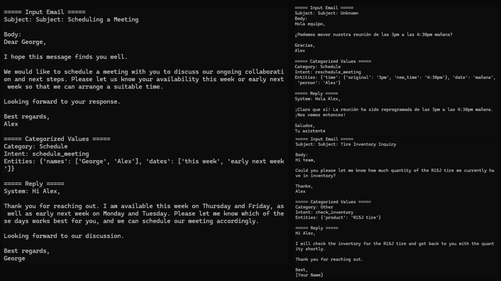

# 📬 LangGraph Email Responder

A LangGraph-powered agentic AI system that generates automatic replies to emails using a fine-tuned large language model. This is a modular and extendable project that aims to:

- Classify incoming emails
- Extract intent and key information
- Generate professional responses
- Log everything for audit and improvement

# 🚧 Work in Progress

The final plan is to use a custom-tuned dataset with various email datasets to classify the kind of email, extract necessary information, and reply in the best way possible using agentic AI with LangGraph.

---

🔭 Coming Soon
--------------

*   Classify emails into categories (support, schedule, billing, etc.)
    
*   Named entity extraction for people, time, and intent
    
*   Multilingual support
    
*   Gmail API integration
    
*   Streamlit front-end
    

---

## 🧠 Architecture

```text
[.txt Email File] 
      │
      ▼
[email_parser.py]  → Parse subject and body
      │
      ▼
[LangGraph] 
  └─> Custom Prompt + ChatOpenAI
      │
      ▼
[reply_generator.py] → Get reply from LLM
      │
      ▼
[csv_logger.py] → Save input/output to CSV
      │
      ▼
[logs/reply_log.csv]
```
## ⚙️ Configuration

Update your `config.yaml`:

```yaml
openai_api_key: "your-openai-key"
model_temperature: 0.3
```
## ▶️ How to Run

1.  **Clone the repo**
2.  **Create a virtual environment** (optional)
3.  **Install dependencies**:
```bash
pip install -r requirements.txt
```
4.  Place a `.txt` email in `test_emails/`
5.  Run the main script:

```bash
python main.py
```

## ✅ Output

* Generated replies are **printed in the console**.
* Also **saved to `logs/reply_log.csv`** with timestamps.
    

🧪 Example
----------

**Input:**

```vbnet
Subject: Meeting Reschedule

Hi team,

Can we move our meeting from 3pm to 4:30pm tomorrow?

Thanks,
Alex
```
**Generated Reply:**

```vbnet
Hi Alex,

Sure, we can reschedule the meeting to 4:30pm tomorrow. I've updated the calendar invite accordingly.

Best regards,  
Support Team
```
